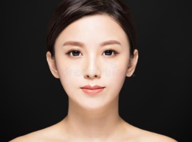
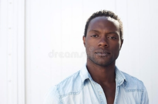

**DETECCIÓN AUTOMÁTICA DE PIEL CON APRENDIZAJE SUPERVISADO**

\1) Dada una imagen RGB en donde aparezca piel y fondo variable\.

1) Tomar  algunas  muestras  Ipiel=I0=10  de  pixeles  de  piel  y  calcular  una  gaussiana tridimensional que represente los colores de la piel y su dispersión.
   1. μpiel, Σpiel en espacio RGB.
   1. Con esto queda definido G(X,μpiel, Σpiel).
1) Tomar algunas muestras de Ifondo=I1=10 de pixeles de fondo de la imagen (no piel) y calcular una gaussiana tridimensional que represente los colores del fondo y su dispersión.
   1. μpiel, Σpiel en espacio RGB.
   1. Con esto queda definido G(X,μpiel, Σpiel).
1) Calcular la probabilidad a priori P(W), Pr(W=piel),Pr(W=fondo).
1) Generar el mapa termico de los likelihood de no piel log(P(X|W=fondo=0)).
1) Mapa termico de piel log(P(X|W=piel=1)).
1) Mapa termico P(W=1|X\*).
1) Imagen binaria P(W=1|X\*)>Threshold T=0.4, T=0.5, T=0.6.

Analisis de las imagenes:

Imagen 1

Primero se realizan pruebas con personas de piel blanca y fondo negro obteniendo estos resultados:

Como se puede observar el umbral que mejor discretiza la piel del fondo es la de T=0.4 y se puede notar que mientras mayor sea el umbral mas pixeles de no piel se van detectando de manera errónea.

* El vector promedio de piel es: 

` `[[0.89882353] 

` `[0.77019608] 

` `[0.68705882]] 

* El vector promedio de fondo es:   

` `[[0.29686275]

` `[0.22941176]  

` `[0.21098039]] 

Imagen 2

Ahora se realizan pruebas con una imagen de piel negra con fondo blanco para ver que tal se comporta, obteniendo los siguientes resultados:

Como se puede ver para pieles negras con fondos blancos también es posible discretizar los pixeles entrenando de nuevo al modelo para esta imagen, siendo el umbral de T=0.4 el que mejor obtiene los datos de la piel.

* El vector promedio de piel es: 

` `[[0.44784314] 

` `[0.31529412] 

` `[0.29764706]] 

* El vector promedio de fondo es: 

` `[[0.6454902 ] 

` `[0.64901961] 

` `[0.66470588]] 

Ahora se analiza el modelo, con una imagen de una mujer en la playa donde el tono de piel es muy similar al color de la arena, y se obtienen estos resultados:

Como se puede observar el modelo si es capaz de discretizar aun cuando el fondo y la piel tienen colores muy similares y el umbral de T=0.4 sigue siendo el que mejor lo discretiza.

* El vector promedio de piel es: 

` `[[0.73686275] 

` `[0.57372549] 

` `[0.48039216]] 

* El vector promedio de fondo es: 

` `[[0.70156863] 

` `[0.59843137] 

` `[0.52352941]] 

Para esta imagen se evaluá como se comporta el modelo cuando los colores de la piel son diferentes y el color de fondo es mas variado, estos resultados se obtuvieron:

Como se puede ver, el modelo si es capaz de discretizar de buena manera los diferentes colores de piel en la misma imagen, sin embargo en este caso el mejor un umbral es el de T=0.6, sin embargo el cabello de la mujer de la derecha lo termina considerando en su mayoría como piel.

* El vector promedio de piel es: 

` `[[0.65294118] 

` `[0.51490196] 

` `[0.4454902 ]] 

* El vector promedio de fondo es: 

` `[[0.69333333] 

` `[0.5545098 ] 

` `[0.49803922]] 
